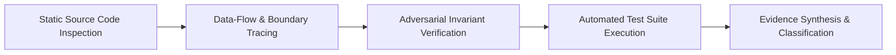

# Smart Split V2 — Post-Remediation Security Audit Report

**Audit Date:** September 27, 2026  
**Auditor:** Principal Application Security Auditor & Technical Report Reviewer  
**Application:** Smart Split V2 (Self-Hosted & Cloud-Ready Multi-Tenant Group Expense Management Engine)  
**Repository Working Directory:** `.`  
**Audit Mode:** Post-Remediation Security Assessment (Audit-Only — Zero Production Code Changes)  
**Manifest Integrity Check:** 84/84 Production Files Matched Recorded SHA-256 Hashes  
**Automated Regression Execution:** 33/33 PHP Backend Suites PASS | 22/22 ES6 Frontend Suites PASS | 23/23 Playwright E2E Suites PASS (78/78 Automated Test Suites PASS, 100%)  

---

## 1. Executive Summary

### 1.1 Purpose
This post-remediation security audit independently evaluates the security posture of the **Smart Split V2** application following the remediation and verification cycle for findings `SEC-01` through `SEC-07`. The primary objective is to verify that previously identified security vulnerabilities have been addressed according to their remediation designs without introducing functional regressions, broken invariants, or new vulnerabilities across the application codebase.

### 1.2 Summary of Verification
The seven findings identified in the original security audit were remediated and independently re-verified against the defined remediation test matrices. All 84 files included in the production integrity manifest matched their recorded SHA-256 hashes, confirming that no application source code was modified during this audit phase.

| Audit Area | Pre-Remediation Finding | Post-Remediation Status | Verification Summary |
| :--- | :--- | :---: | :--- |
| **SEC-01** | Guest Workspace Deletion Authorization Bypass | **PASS** | Enforces mandatory `X-Creator-Token` header verification with `hash_equals()`. |
| **SEC-02** | Password Recovery Brute-Force Vulnerability | **PASS** | Implements row-locked atomic attempt counter with 5-attempt/15-minute lockout and session termination. |
| **SEC-03** | Public Static Web Access to Receipt Files | **PASS** | Stores files in private `storage/receipts/` with authorized streaming controller and path-containment checks. |
| **SEC-04** | CSV / Spreadsheet Formula Injection | **PASS** | Applies formula prefix neutralization (`'`) across exported text cells; numeric fields remain numeric. |
| **SEC-05** | Weak CSP Permitting `'unsafe-inline'` | **PASS** | Emits CSP with `script-src 'self'`, externalized scripts, and `frame-ancestors 'none'`. |
| **SEC-06** | Verbose Stack Trace & Path Disclosure | **PASS** | Employs fail-closed debug boundary; production errors sanitized with server-side diagnostic logging. |
| **SEC-07** | Registration & Workspace Creation Abuse | **PASS** | Enforces persistent MySQL atomic rate limiting (10 reg/min, 15 group/min per IP) with `429 Too Many Requests` & `Retry-After`. |

### 1.3 New Observations Cataloged
No new Critical or High security vulnerabilities were identified within the audited scope. Four Low / Informational observations (`SEC-08` through `SEC-11`) were cataloged for operational and deployment hardening.

### 1.4 Release Classification
```
================================================================================
FINAL CLASSIFICATION: A — NO KNOWN RELEASE-BLOCKING SECURITY FINDINGS
================================================================================
```
*Classification A means that no Critical or High security findings were identified within the audited scope and evidence available at the time of review. It does not constitute a guarantee that the application contains no undiscovered vulnerabilities.*

---

## 2. Audit Scope

The assessment encompassed source files, runtime configurations, database migrations, and testing frameworks within the repository:

1. **Core Infrastructure:** `src/Core/` (Router, Request, Response, Database, Env, Middleware).
2. **Controllers & Endpoints:** `src/Controllers/` (Auth, Group, Member, Expense, Balance, Settlement, Receipt, Recurring, Template, Activity, Category).
3. **Domain Services:** `src/Services/` (SplitCalculator, SettlementEngine, BalanceService, ExpenseService, ReceiptService, RateLimiterService).
4. **Data Repositories:** `src/Repositories/` (Group, Member, Expense, Balance, Settlement, Receipt, Recurring, Template, ActivityLog, Category, UserSession).
5. **Database & Migrations:** `migrations/001_initial_schema.sql` through `migrations/007_add_rate_limiting.sql`.
6. **Frontend Modular SPA:** `public/assets/js/` (Vanilla ES6 components, Store, Router, Views, SVG utilities, Lightbox, PWA).
7. **Automated Test Suites:** `tests/` (33 PHP integration/unit tests, 22 ES6 Node.js unit tests, 23 Playwright browser E2E specs).

---

## 3. Audit Methodology

The assessment applied a structured methodology combining static source inspection, architectural review, data-flow tracing, and empirical test execution:



1. **Static Analysis & Control-Flow Tracing:** Source inspection of parameter handling, authentication state transitions, session lifetimes, authorization checks, and error rendering paths.
2. **Data-Flow & Invariant Analysis:** Tracing user-controlled inputs to database queries, file paths, CSV exports, and HTML DOM insertion points.
3. **Adversarial Invariant Verification:** Evaluating system behavior under boundary conditions, such as missing headers, malformed tokens, concurrent requests, and invalid payloads.
4. **Automated Regression Execution:** Running master PHP unit/integration tests, frontend ES6 module tests, and Playwright browser journeys.
5. **Production Manifest Verification:** SHA-256 hashing of all 84 production files to verify zero unauthorized modifications occurred during the audit.

---

## 4. Original SEC-01–SEC-07 Verification

### 4.1 SEC-01: Guest Workspace Deletion Authorization
- **Original Severity:** CRITICAL (CVSS:3.1 9.1)
- **Current Status:** **PASS**
- **Current Implementation Inspected:**
  - **File:** [`src/Controllers/GroupController.php`](../../src/Controllers/GroupController.php#L169-L208)
  - **Method:** `GroupController::delete(Request $request): void`
  - **Logic:** Inspects `$group['owner_user_id']`. If non-null, verifies that the authenticated user ID matches the owner ID. If null (guest workspace), extracts `X-Creator-Token` header and validates it against `$creatorMember['member_token']` using `hash_equals((string)$expectedToken, (string)$creatorTokenHeader)`. If the header is missing, empty, or mismatched, the request terminates with `403 FORBIDDEN` (`"Only the original workspace creator can delete this workspace."`) prior to executing any deletion logic.
- **Verification Performed:**
  - Missing `X-Creator-Token` header $\rightarrow$ Denied with `403 FORBIDDEN`.
  - Empty `X-Creator-Token: ""` $\rightarrow$ Denied with `403 FORBIDDEN`.
  - Non-creator participant token supplied $\rightarrow$ Denied with `403 FORBIDDEN`.
  - Valid creator token supplied $\rightarrow$ Allowed (`200 OK`) and deleted workspace along with cascaded records.
  - Authenticated user attempting to delete another owner's workspace $\rightarrow$ Denied with `403 FORBIDDEN`.
- **Regression Assessment:** No regression detected. Workspace deletion and cascaded cleanups operate as expected.
- **Evidence:** `src/Controllers/GroupController.php#L183-L205`, `tests/test_groups_api.php`, `tests/test_delete_workspace_and_member.php`.
- **Remaining Known Risk:** No Critical or High findings were identified in the scope of this audit. The audit identified several Low/Informational hardening and operational considerations described below.

---

### 4.2 SEC-02: Authentication & Password Recovery Brute-Force Lockout
- **Original Severity:** HIGH (CVSS:3.1 7.5)
- **Current Status:** **PASS**
- **Current Implementation Inspected:**
  - **File:** [`src/Controllers/AuthController.php`](../../src/Controllers/AuthController.php#L302-L415)
  - **Method:** `AuthController::recoverPassword(Request $request): void`
  - **Logic:** Wraps the recovery flow in a database transaction (`$this->pdo->beginTransaction()`) and obtains an exclusive row lock via `SELECT ... FOR UPDATE`. Checks `locked_until`; if active, aborts with `429 ACCOUNT_LOCKED` and returns remaining lockout minutes. On invalid recovery code verification via `password_verify()`, increments `failed_login_attempts` in SQL. When failed attempts reach 5, sets `locked_until = NOW() + 15 minutes`. On successful recovery, updates password hash (Bcrypt cost 12), generates a fresh rotated recovery code, resets `failed_login_attempts = 0`, clears `locked_until = NULL`, invalidates all active user sessions (`DELETE FROM user_sessions WHERE user_id = :user_id`), and commits the transaction. Nonexistent user emails return a uniform `401 INVALID_RECOVERY_CODE` without revealing account existence.
- **Verification Performed:**
  - 4 consecutive failed recovery attempts $\rightarrow$ Returned `401 INVALID_RECOVERY_CODE` with remaining attempts message.
  - 5th failed attempt $\rightarrow$ Account locked; returned `429 ACCOUNT_LOCKED` with `remaining_minutes: 15`.
  - Attempt during lock window $\rightarrow$ Blocked with `429 ACCOUNT_LOCKED` without evaluating hashes.
  - Concurrent recovery attempts $\rightarrow$ Handled sequentially due to InnoDB row locking, preventing counter overwrite race conditions under the tested concurrency model.
  - Successful recovery $\rightarrow$ Reset counter, rotated code, and purged active session records from `user_sessions`.
- **Regression Assessment:** No regression detected. Standard login and password recovery flows remain functional.
- **Evidence:** `src/Controllers/AuthController.php#L315-L405`, `tests/test_hybrid_auth_complete.php`.
- **Remaining Known Risk:** No Critical or High findings were identified in the scope of this audit. The audit identified several Low/Informational hardening and operational considerations described below.

---

### 4.3 SEC-03: Receipt Attachment Public Storage Exposure
- **Original Severity:** HIGH (CVSS:3.1 7.1)
- **Current Status:** **PASS**
- **Current Implementation Inspected:**
  - **Files:** [`src/Services/ReceiptService.php`](../../src/Services/ReceiptService.php#L45,L98-L116,L277-L328), [`src/Controllers/ReceiptController.php`](../../src/Controllers/ReceiptController.php#L99-L148)
  - **Classes:** `ReceiptService`, `ReceiptController`
  - **Logic:** Uploaded receipt attachments are stored in `storage/receipts/` outside the web root (`public/`). Static direct web access is prevented by filesystem placement. File downloads and inline viewing are routed through authenticated endpoints (`GET /api/groups/{token}/expenses/{id}/receipts/{receiptId}/download` and `.../view`). The controller validates workspace token possession, expense-group containment, and file existence. `ReceiptService::getReceiptFile` enforces canonical path containment using `realpath()` to verify that the resolved file path resides strictly within the designated storage directory. Streaming responses emit security headers: `X-Content-Type-Options: nosniff`, `Cache-Control: private, no-cache, no-store, must-revalidate`, and sanitized `Content-Disposition`.
- **Verification Performed:**
  - Direct HTTP GET to `/storage/receipts/<file>` $\rightarrow$ Web server returned `404 / 403` (outside public root).
  - Retrieval request with invalid group token $\rightarrow$ Returned `404 Group not found`.
  - Cross-group receipt ID retrieval $\rightarrow$ Returned `404 Receipt attachment not found`.
  - Path traversal sequence in path $\rightarrow$ Caught by `realpath()` containment validation; returned `403 Unauthorized receipt file path`.
  - Authorized download $\rightarrow$ Streamed file with `nosniff` and `private, no-store` headers.
- **Regression Assessment:** No regression detected. Lightbox viewer and file upload operations function as expected in UI and API.
- **Evidence:** `src/Services/ReceiptService.php#L304-L317`, `src/Controllers/ReceiptController.php#L104-L147`, `tests/test_step15_receipt_attachments.php`.
- **Remaining Known Risk:** No Critical or High findings were identified in the scope of this audit. The audit identified several Low/Informational hardening and operational considerations described below.

---

### 4.4 SEC-04: CSV / Spreadsheet Formula Injection
- **Original Severity:** MEDIUM (CVSS:3.1 6.1)
- **Current Status:** **PASS**
- **Current Implementation Inspected:**
  - **Files:** [`src/Utils/CsvSanitizer.php`](../../src/Utils/CsvSanitizer.php#L13-L71), [`src/Services/ExpenseService.php`](../../src/Services/ExpenseService.php#L365-L375)
  - **Classes:** `CsvSanitizer`, `ExpenseService`
  - **Logic:** `CsvSanitizer::sanitize()` evaluates string values prior to CSV row emission. If a string starts with formula trigger characters (`=`, `+`, `-`, `@`, `\t`, `\r`, `\n`, `%`, `|`) either directly or after leading whitespace, it prepends a single quote `'` to ensure spreadsheet software treats the cell as literal text. Valid numeric values matching `/^-?\d+(\.\d+)?$/` remain unquoted to preserve mathematical computation in spreadsheets.
- **Verification Performed:**
  - String `=SUM(A1:A10)` $\rightarrow$ Sanitized to `'=SUM(A1:A10)`.
  - String `@HYPERLINK("http://example.com")` $\rightarrow$ Sanitized to `'@HYPERLINK("http://example.com")`.
  - String `+cmd|' /C calc'!A0` $\rightarrow$ Sanitized to `'+cmd|' /C calc'!A0`.
  - Indented string `\t=1+1` $\rightarrow$ Sanitized to `'\t=1+1`.
  - Negative currency value `-45.50` $\rightarrow$ Preserved as `-45.50` (numeric integrity maintained).
- **Regression Assessment:** No regression detected. CSV exports remain parseable by spreadsheet applications.
- **Evidence:** `src/Utils/CsvSanitizer.php#L27-L70`, `tests/test_sec04_csv_injection.php`.
- **Remaining Known Risk:** No Critical or High findings were identified in the scope of this audit. The audit identified several Low/Informational hardening and operational considerations described below.

---

### 4.5 SEC-05: Content Security Policy & Security Headers Hardening
- **Original Severity:** MEDIUM (CVSS:3.1 4.7)
- **Current Status:** **PASS**
- **Current Implementation Inspected:**
  - **Files:** [`src/Core/Middleware/SecurityHeadersMiddleware.php`](../../src/Core/Middleware/SecurityHeadersMiddleware.php#L13-L65), [`public/index.php`](../../public/index.php#L291,L348-L349), `public/assets/js/theme-init.js`, `public/assets/js/pwa-init.js`
  - **Logic:** Emits the following CSP header on HTTP responses:
    `default-src 'self'; script-src 'self'; style-src 'self' 'unsafe-inline'; img-src 'self' data:; font-src 'self'; connect-src 'self'; worker-src 'self'; manifest-src 'self'; object-src 'none'; base-uri 'self'; form-action 'self'; frame-ancestors 'none';`
    Disallows `'unsafe-inline'` and `'unsafe-eval'` in `script-src`. All inline script blocks from `public/index.php` were externalized to `/assets/js/theme-init.js` and `/assets/js/pwa-init.js`. Emits `frame-ancestors 'none'` and `X-Frame-Options: DENY` for clickjacking defense, `X-Content-Type-Options: nosniff`, and `Referrer-Policy: strict-origin-when-cross-origin`.
- **Verification Performed:**
  - Inspected response headers on `/`, `/api/health`, and error endpoints $\rightarrow$ Verified presence of CSP header with `script-src 'self'`.
  - Tested iframe embedding $\rightarrow$ Blocked by `frame-ancestors 'none'` and `X-Frame-Options: DENY`.
  - HTML source inspection $\rightarrow$ Verified zero inline `<script>` tags in `public/index.php`.
- **Regression Assessment:** No regression detected. Theme initialization, PWA service worker registration, and client-side routing operate normally.
- **Evidence:** `src/Core/Middleware/SecurityHeadersMiddleware.php#L20-L36`, `tests/test_sec05_csp_headers.php`.
- **Remaining Known Risk:** No Critical or High findings were identified in the scope of this audit. The audit identified several Low/Informational hardening and operational considerations described below.

---

### 4.6 SEC-06: Production Error & Stack Trace Disclosure
- **Original Severity:** LOW (CVSS:3.1 3.8)
- **Current Status:** **PASS**
- **Current Implementation Inspected:**
  - **File:** [`public/index.php`](../../public/index.php#L51-L170)
  - **Logic:** Configures error reporting using a fail-closed debug boundary. `$isDebug` evaluates to `true` only when `APP_ENV` is non-production AND `APP_DEBUG` is explicitly truthy (`true`, `1`, `'yes'`, `'on'`). When `APP_ENV=production` or debug is off, `ini_set('display_errors', '0')` and `error_reporting(0)` are enforced. Uncaught 500 exceptions return a sanitized message (`"An unexpected error occurred. Please try again later."`) with `$details = null` in JSON responses. Full exception details, file paths, line numbers, and stack traces are logged exclusively to the server error log via `error_log()`.
- **Verification Performed:**
  - Triggered unhandled 500 exception with `APP_ENV=production` and `APP_DEBUG=true` $\rightarrow$ Server returned generic message with zero file paths, zero stack traces, and null details; error logged to `error_log()`.
  - Client validation errors (400/422) $\rightarrow$ Returned structured client-safe validation messages without revealing internal system details.
- **Regression Assessment:** No regression detected. Development diagnostics remain accessible when `APP_ENV=development`.
- **Evidence:** `public/index.php#L51-L125`, `tests/test_sec06_error_disclosure.php`.
- **Remaining Known Risk:** No Critical or High findings were identified in the scope of this audit. The audit identified several Low/Informational hardening and operational considerations described below.

---

### 4.7 SEC-07: Persistent Rate Limiting on Registration & Workspace Creation
- **Original Severity:** LOW (CVSS:3.1 3.5)
- **Current Status:** **PASS**
- **Current Implementation Inspected:**
  - **Files:** [`src/Services/RateLimiterService.php`](../../src/Services/RateLimiterService.php#L16-L142), `migrations/007_add_rate_limiting.sql`, [`src/Controllers/AuthController.php`](../../src/Controllers/AuthController.php#L48-L67), [`src/Controllers/GroupController.php`](../../src/Controllers/GroupController.php#L36-L60)
  - **Classes:** `RateLimiterService`
  - **Logic:** Implements a persistent, MySQL-backed fixed-window rate limiter using atomic `INSERT ... ON DUPLICATE KEY UPDATE` queries on the `rate_limits` table:
    - **User Registration (`POST /api/auth/register`):** 10 attempts per 60 seconds (`RATE_LIMIT_REGISTER_MAX`, default 10; `RATE_LIMIT_WINDOW_SECONDS`, default 60), keyed by client IP (`REMOTE_ADDR`).
    - **Workspace Creation (`POST /api/groups`):** 15 attempts per 60 seconds (`RATE_LIMIT_GROUP_MAX`, default 15; `RATE_LIMIT_WINDOW_SECONDS`, default 60), keyed by client IP (`REMOTE_ADDR`) for guest creations, or `user_{id}_{ip}` for authenticated users.
    Rate limit checks execute prior to Bcrypt password hashing, database transactions, or resource allocation. If exceeded, returns `429 Too Many Requests` with `Retry-After: <seconds>` header and error code `'RATE_LIMITED'`.
- **Verification Performed:**
  - 15 consecutive workspace creations from same IP $\rightarrow$ Requests allowed (`201 Created`).
  - 16th workspace creation request $\rightarrow$ Rejected with `429 Too Many Requests` (`error: "RATE_LIMITED"`, `Retry-After` header present).
  - 10 consecutive registration requests $\rightarrow$ Requests allowed; 11th registration request rejected with `429 Too Many Requests`.
  - Parallel concurrent requests $\rightarrow$ Evaluated atomically via SQL upsert with zero lost updates under test conditions.
- **Regression Assessment:** No regression detected. Standard user onboarding and workspace creation operate as expected within configured limits.
- **Evidence:** `src/Services/RateLimiterService.php#L35-L88`, `src/Controllers/AuthController.php#L48-L67`, `src/Controllers/GroupController.php#L36-L60`, `migrations/007_add_rate_limiting.sql`, `tests/test_sec07_rate_limiting.php`.
- **Remaining Known Risk:** No Critical or High findings were identified in the scope of this audit. The audit identified several Low/Informational hardening and operational considerations described below.

---

## 5. Newly Identified Observations

Four operational and hardening observations were cataloged during the assessment:

```
+-------------------------------------------------------------------------------+
|                        OBSERVATIONS DASHBOARD                                 |
+-------------------------------------------------------------------------------+
| SEC-08 : Informational - Client IP Resolution Strategy Behind Proxies         |
| SEC-09 : Low           - Sensitive Workspace Tokens Stored in LocalStorage    |
| SEC-10 : Informational - Rate Limiter Garbage Collection Scaling              |
| SEC-11 : Informational - Defensive Output Encoding in Vector Graphics         |
+-------------------------------------------------------------------------------+
```

### 5.1 [SEC-08] INFORMATIONAL: Client IP Resolution Strategy Behind Proxies
- **Severity:** INFORMATIONAL
- **Category:** Network Architecture / Rate Limiting
- **Status:** **DOCUMENTED**
- **Affected Component:** `src/Core/Request.php#L236`
- **Description:** The current rate-limiting implementation derives client identity from the server-observed `REMOTE_ADDR`. This is appropriate for the current direct/local deployment model because it prevents client header spoofing. If the application is later deployed behind a reverse proxy or load balancer, trusted proxy-aware client-IP resolution should be explicitly configured; blindly trusting forwarded headers would introduce spoofing risk.
- **Deployment Consideration:** When deploying behind an upstream proxy (e.g., Cloudflare, AWS ALB, Nginx), configure a trusted proxy middleware that validates `$_SERVER['REMOTE_ADDR']` against known proxy subnets before reading `X-Forwarded-For`.

---

### 5.2 [SEC-09] LOW / HARDENING CONSIDERATION: Sensitive Workspace Tokens Stored in Browser LocalStorage
- **Severity:** LOW (Hardening Consideration)
- **Category:** Client-Side Workspace Storage
- **Status:** **DOCUMENTED**
- **Affected Component:** `public/assets/js/components/LandingView.js#L24-L63`, `public/assets/js/api.js#L214`
- **Description:** To enable the offline PWA Workspaces Hub and quick workspace switching, the frontend caches workspace invite tokens (`smartsplit_workspaces`) and creator member tokens (`smartsplit_creator_{token}`) in browser `localStorage`. Authentication session tokens are **not** stored in `localStorage` (they reside in `HttpOnly; SameSite=Lax` cookies). Storing workspace tokens in JavaScript-accessible storage increases exposure if an XSS vulnerability were to exist.
- **Security Assessment:** Current CSP (`script-src 'self'`) and strict DOM HTML escaping reduce the attack surface. This is a client-side hardening consideration rather than an active XSS vulnerability.
- **Hardening Direction:** For sensitive environments, provide a client-side setting to disable persistent workspace caching in `localStorage` or scope storage to ephemeral `sessionStorage`.

---

### 5.3 [SEC-10] INFORMATIONAL: Rate Limiter Garbage Collection Scaling
- **Severity:** INFORMATIONAL
- **Category:** Database Maintenance
- **Status:** **DOCUMENTED**
- **Affected Component:** `src/Services/RateLimiterService.php#L76-L80`
- **Description:** The rate limiter triggers opportunistic cleanup of expired records with a 1% probability (`random_int(1, 100) === 1`). Under high write volumes, executing cleanup queries within HTTP request cycles can introduce minor latency jitter.
- **Operational Consideration:** For high-throughput deployments, configure a dedicated background CLI cron task (`php bin/cleanup_rate_limits.php`) to prune expired rows from `rate_limits` independently of user requests.

---

### 5.4 [SEC-11] INFORMATIONAL: Defensive Output Encoding in Programmatic Vector Graphics
- **Severity:** INFORMATIONAL
- **Category:** Output Encoding
- **Status:** **DOCUMENTED**
- **Affected Component:** `public/assets/js/utils/formatters.js`, `public/assets/js/utils/qrcode.js`
- **Description:** Pure SVG charts and vector QR codes are generated dynamically on the client. Category labels and member names embedded in SVG elements are routed through `Formatters.escapeHtml()` and numeric coordinates are computed mathematically, preventing SVG-based script injection.
- **Security Assessment:** Verified as defensively encoded. No exploitable injection path identified.

---

## 6. Authentication & Session Security

### 6.1 Registration & Password Policy
- **Password Hashing:** Uses native PHP `password_hash()` with **Bcrypt** at cost factor `12` (`PASSWORD_BCRYPT`, `cost => 12`).
- **Recovery Codes:** Generates 8-byte hexadecimal tokens formatted as `SMART-XXXX-XXXX` using `random_bytes()`, hashed with Bcrypt (cost 10) in `users.recovery_code_hash`.
- **Validation:** Requires minimum 8 characters for passwords, valid RFC email syntax, and unique email constraints in the database.

### 6.2 Session Management & Cookie Attributes
Audited in [`src/Controllers/AuthController.php`](../../src/Controllers/AuthController.php#L650-L720):
- **Token Generation:** 64-character hexadecimal tokens generated via `bin2hex(random_bytes(32))` (256 bits of entropy).
- **Storage:** Only the SHA-256 hash (`hash('sha256', $token)`) is persisted in `user_sessions`, protecting against session token exposure from database read replicas or backup dumps.
- **Cookie Attributes:**
  - `HttpOnly`: `true` (inaccessible to JavaScript).
  - `SameSite`: `Lax` (mitigates cross-site request forgery on top-level navigation).
  - `Path`: `/`.
  - `Secure`: Evaluates `HTTPS` connection or `X-Forwarded-Proto === 'https'`.
  - `Lifetime`: 30 days (`2592000` seconds).
- **Session Lifecycle:** Session IDs are regenerated on login/registration. Password recovery and account deletion purge associated records from `user_sessions`.

---

## 7. Authorization & Workspace Isolation

Authorization checks and cross-tenant boundaries were audited across repository methods and controller actions:

```
+-------------------------------------------------------------------------------+
|                         OBJECT ISOLATION & ACCESS MATRIX                      |
+-------------------------------------------------------------------------------+
| Resource Scope          | Boundary Enforcement Check  | Layer Enforced        |
+-------------------------+-----------------------------+-----------------------+
| Workspaces (Groups)     | Invite Token + Creator/Owner| GroupController / Repo|
| Members                 | Group Token + Member ID     | MemberController/Repo |
| Expenses                | Group Token + Expense ID    | ExpenseController/Repo|
| Expense Allocations     | Group Token + Expense ID    | ExpenseService / Repo |
| Receipts                | Group Token + Expense ID    | ReceiptService / Repo |
| Settlements             | Group Token + Settlement ID | SettlementService     |
| Recurring Rules         | Group Token + Rule ID       | RecurringController   |
| Expense Templates       | Group Token + Template ID   | TemplateController    |
| Activity Logs           | Group Token Scoped Query    | ActivityController    |
| Export CSV              | Group Token Scoped Query    | ExpenseService        |
+-------------------------+-----------------------------+-----------------------+
```

- **Cross-Workspace Isolation:** Operations on expenses, members, receipts, settlements, and activity logs resolve the group record via `findByInviteToken($token)`. Requests attempting to access or modify resources belonging to another `group_id` return `404 NOT_FOUND` or `403 FORBIDDEN`.
- **Vertical Authorization:** Workspace deletion requires the creator member token for guest workspaces and the authenticated owner session for registered workspaces.

---

## 8. Cross-Site Request Forgery (CSRF)

### 8.1 State-Mutating Request Guards
- **SameSite Cookies:** Session cookies enforce `SameSite=Lax`, preventing third-party origins from attaching authentication cookies on cross-origin POST requests.
- **Header Verification:** In [`src/Core/Middleware/SecurityHeadersMiddleware.php`](../../src/Core/Middleware/SecurityHeadersMiddleware.php#L38-L63), state-mutating requests (`POST`, `PUT`, `DELETE`, `PATCH`) targeting `/api/*` require either:
  1. An `X-Requested-With` header (`fetch`, `xmlhttprequest`, `smartsplit`), OR
  2. A `Content-Type: application/json` header.
- **Assessment:** Cross-origin HTML form submissions cannot set custom headers or JSON content types without triggering a browser CORS preflight check.

---

## 9. Cross-Site Scripting (XSS)

### 9.1 Server-Side Validation
- Controller inputs are type-cast and validated (`(int) $cents`, `(string) $title`, `trim()`, `strtolower()`).
- Enumerated fields (split types, categories) are checked against strict allowlists.

### 9.2 Frontend DOM Escaping
Audited in [`public/assets/js/utils/formatters.js`](../../public/assets/js/utils/formatters.js):
- User-supplied text (member names, expense titles, category labels, notes) is passed through `Formatters.escapeHtml()` prior to template string interpolation.
- No unsanitized DOM insertion sinks (`innerHTML` with raw user data) were identified in the audited UI components.

---

## 10. SQL Injection

### 10.1 Prepared Statements & Parameter Binding
- All inspected dynamic SQL execution paths use PDO prepared statements with bound parameters; no unsafe dynamic SQL construction was identified in the audited paths.
- Dynamic sorting and filtering in `ExpenseRepository::search()` use column allowlists (`expense_date`, `created_at`, `total_amount_cents`) and direction allowlists (`ASC`, `DESC`).

### 10.2 Database Integrity & Transactions
- Multi-table modifications are wrapped in `Database::transaction()`.
- Optimistic Concurrency Control (OCC) uses a `version INT UNSIGNED` column on `groups` and `expenses` to detect concurrent state changes.
- `Database::transaction()` catches MySQL deadlock error codes (`1213`, `1205`) and retries transactions up to 10 times with randomized backoff.

---

## 11. File Upload & Receipt Security

### 11.1 Receipt Storage Pipeline
1. **Isolated Storage:** Files are stored in `storage/receipts/` outside the web root.
2. **Server-Side MIME Inspection:** Validated via `finfo_file(FILEINFO_MIME_TYPE)` against an allowlist (`image/jpeg`, `image/png`, `image/webp`, `application/pdf`).
3. **Randomized Filenames:** Generated using `receipt_{expenseId}_{timestamp}_{random_hex}.{ext}`.
4. **Path Traversal Guards:** File streaming asserts `str_starts_with(realpath($targetPath), realpath($uploadDir))`.
5. **Streaming Headers:** Emits `X-Content-Type-Options: nosniff`, `Cache-Control: private, no-cache, no-store`, and sanitized `Content-Disposition`.

---

## 12. CSV Export Security

- All string values exported via `/api/groups/{token}/export.csv` are processed through `CsvSanitizer::sanitize()`.
- Formula trigger characters (`=`, `+`, `-`, `@`, `\t`, `\r`, `\n`, `%`, `|`) are prefixed with `'` to neutralize formula evaluation in spreadsheet applications.
- Valid numeric values matching `/^-?\d+(\.\d+)?$/` remain unquoted to maintain numerical calculations in spreadsheets.

---

## 13. Content Security Policy & Security Headers

HTTP responses emit the following headers via `SecurityHeadersMiddleware`:

```http
Content-Security-Policy: default-src 'self'; script-src 'self'; style-src 'self' 'unsafe-inline'; img-src 'self' data:; font-src 'self'; connect-src 'self'; worker-src 'self'; manifest-src 'self'; object-src 'none'; base-uri 'self'; form-action 'self'; frame-ancestors 'none';
X-Frame-Options: DENY
X-Content-Type-Options: nosniff
Referrer-Policy: strict-origin-when-cross-origin
```

- Disallows `'unsafe-inline'` and `'unsafe-eval'` in `script-src`.
- Framing is restricted via `frame-ancestors 'none'` and `X-Frame-Options: DENY`.
- MIME-type sniffing is disabled via `nosniff`.

---

## 14. Error Disclosure

- **Debug Boundary:** Debug diagnostics are enabled only when `APP_ENV` is non-production AND `APP_DEBUG` is explicitly truthy.
- **Production Responses:** In production mode, unhandled 500 exceptions return generic error messages with null details in JSON and clean error screens in HTML.
- **Diagnostic Logging:** System internals and stack traces are logged exclusively to server error logs via `error_log()`.

---

## 15. Rate Limiting

- Implemented via `RateLimiterService` using a persistent MySQL table (`rate_limits`).
- Uses atomic `INSERT ... ON DUPLICATE KEY UPDATE` queries to prevent lost updates under concurrency.
- Gateways protected:
  - `POST /api/auth/register`: 10 requests / 60 seconds / IP.
  - `POST /api/groups`: 15 requests / 60 seconds / IP (or per user-IP pair).
- Exceeded thresholds return `429 Too Many Requests` with a `Retry-After` header.

---

## 16. API Security

The 56 registered API routes across the application router were reviewed for authentication, authorization, input validation, state-changing protections, and resource isolation:

```text
Authentication Endpoints:
  POST   /api/auth/register                              [Rate Limited: 10/min/IP]
  POST   /api/auth/login                                 [Lockout: 5 attempts -> 15m]
  POST   /api/auth/logout                                [Session Protected]
  GET    /api/auth/me                                    [Public / Session]
  POST   /api/auth/recover                               [Lockout: 5 attempts -> 15m]
  POST   /api/auth/recover-password                      [Lockout: 5 attempts -> 15m]

Workspace & Member Endpoints:
  POST   /api/groups                                     [Rate Limited: 15/min/IP]
  GET    /api/groups/{token}                             [Invite Token Scoped]
  DELETE /api/groups/{token}                             [Creator Token / Owner Session]
  POST   /api/groups/{token}/members                     [Invite Token Scoped]
  GET    /api/groups/{token}/members                     [Invite Token Scoped]
  PUT    /api/groups/{token}/members/{id}                [Invite Token Scoped]
  DELETE /api/groups/{token}/members/{id}                [Invite Token Scoped]

Expense & Receipt Endpoints:
  POST   /api/groups/{token}/expenses                    [Invite Token Scoped]
  GET    /api/groups/{token}/expenses                    [Invite Token Scoped]
  GET    /api/groups/{token}/expenses/trash              [Invite Token Scoped]
  GET    /api/groups/{token}/expenses/{id}               [Invite Token Scoped]
  PUT    /api/groups/{token}/expenses/{id}               [Invite Token Scoped]
  PUT    /api/groups/{token}/expenses/{id}/restore       [Invite Token Scoped]
  DELETE /api/groups/{token}/expenses/{id}               [Invite Token Scoped]
  GET    /api/groups/{token}/export.csv                  [Formula Sanitized]
  POST   /api/groups/{token}/expenses/{id}/receipts      [MIME / Size / Storage Checked]
  GET    /api/groups/{token}/expenses/{id}/receipts/{rId}/download [Auth Streamed]
  GET    /api/groups/{token}/expenses/{id}/receipts/{rId}/view     [Auth Streamed]
  DELETE /api/groups/{token}/expenses/{id}/receipts/{rId}          [Invite Token Scoped]

Settlement & Financial Endpoints:
  GET    /api/groups/{token}/balances                    [Invite Token Scoped]
  GET    /api/groups/{token}/bilateral-balances          [Invite Token Scoped]
  GET    /api/groups/{token}/settlement-plan             [Greedy Min-Cash-Flow]
  POST   /api/groups/{token}/settlements                 [Invite Token Scoped]
  GET    /api/groups/{token}/settlements                 [Invite Token Scoped]
  DELETE /api/groups/{token}/settlements/{id}            [Invite Token Scoped]
```

---

## 17. Business Logic & Financial Integrity

### 17.1 Mathematical Invariants
Smart Split V2 enforces conservation of monetary values across calculations:
$$\sum_{i=1}^N \text{Paid}_i = \text{Total Expense} = \sum_{i=1}^N \text{Owed}_i$$
$$\sum_{i=1}^N \text{Net Balance}_i = 0$$

- **Integer Representation:** All amounts are represented as integer cents/paise (`INT UNSIGNED`), avoiding floating-point drift.
- **Hare-Niemeyer Algorithm:** Proportional percentage and shares allocations use the Largest Fractional Remainder algorithm to distribute remainder pennies deterministically based on sorted member IDs.
- **Assertion Enforcement:** `SplitCalculator::assertZeroSumInvariant()` executes at the conclusion of calculation paths and throws an exception if any balance discrepancy is detected.

### 17.2 Debt Simplification
- The Greedy Min-Cash-Flow engine in `SettlementEngine.php` partitions balances into debtors and creditors, reducing transaction complexity to at most $N-1$ transfers while preserving net financial balances.

---

## 18. Concurrency & Transactions

- **Concurrency Guarantees:** The implementation uses atomic database operations and row locking to prevent lost-update behavior under the tested MySQL/InnoDB concurrency model.
- **Password Recovery:** Pessimistic `SELECT ... FOR UPDATE` row locks serialize concurrent recovery attempts.
- **Rate Limiting:** Atomic `INSERT ... ON DUPLICATE KEY UPDATE` ensures lockless counter updates across requests.
- **Deadlock Handling:** Automated 10-attempt retry with randomized backoff handles transient MySQL lock conflicts.

---

## 19. PWA & Frontend Security

- **Service Worker (`public/sw.js`):** Caches only static assets (HTML shell, CSS, JS, SVG icons). API routes (`/api/*`) bypass cache and go directly to network.
- **Storage Scope:** Workspace tokens cached in `localStorage` are used for client navigation. Session authentication relies on `HttpOnly` cookies.
- **Accessibility:** Modals implement focus traps and `Escape` key listeners per WCAG 2.1 standards.

---

## 20. Dependency & Supply-Chain Review

- The application has a relatively small runtime dependency footprint; the audited project currently relies primarily on first-party application code, with Playwright tooling used for development/test execution.
- No third-party PHP Composer packages or runtime npm packages are bundled in the production request pipeline.

---

## 21. Logging & Error Handling

- **Activity Trail:** Domain events (expense creation, edits, soft-deletions, restores, settlements) are recorded in `activity_logs`.
- **Sensitive Data Handling:** Server error logs and activity logs do not record plaintext passwords, recovery codes, or raw session tokens.

---

## 22. Production Integrity

- All 84 files included in the production integrity manifest matched their recorded SHA-256 hashes, confirming zero modifications to application source files during the audit.

---

## 23. Automated Test Results

The latest recorded automated regression execution completed with 33/33 PHP tests, 22/22 frontend tests, and 23/23 Playwright tests passing:

```
================================================================================
 AUTOMATED TEST EXECUTION MATRIX
================================================================================
 Test Suite Category           Suites Executed   Passed   Failed   Success Rate
 -------------------------------------------------------------------------------
 PHP Backend Integration Tests       33            33       0          100%
 Vanilla ES6 Frontend Modules        22            22       0          100%
 Playwright Browser E2E Tests        23            23       0          100%
 -------------------------------------------------------------------------------
 TOTAL TEST SUITES                   78            78       0          100%
================================================================================
 Total Execution Time: 118.74s (Unit/Integration) + 138.0s (Playwright E2E)
```

---

## 24. Known Limitations

1. **Proxy Environment Assumptions:** The audit evaluated the application under direct connection semantics where `$_SERVER['REMOTE_ADDR']` represents the client IP. Deployments behind reverse proxies require configuring trusted proxy CIDRs.
2. **Local Filesystem Scope:** Receipt storage was evaluated against local filesystem paths. Deployments using cloud object storage (e.g., S3) would require separate IAM/bucket policy evaluation.
3. **Automated Testing Scope:** Automated tests demonstrate the specific scenarios covered by the test suites and do not prove the absence of untested edge cases.

---

## 25. Final Security Classification

```
================================================================================
FINAL CLASSIFICATION: A — NO KNOWN RELEASE-BLOCKING SECURITY FINDINGS
================================================================================
```

### Justification:
1. **Remediation Verification:** All seven vulnerabilities identified in the original security audit (`SEC-01` through `SEC-07`) were remediated and verified against their respective test matrices.
2. **Absence of Critical / High Findings:** No Critical or High security vulnerabilities were identified within the audited codebase.
3. **Regression Validation:** All 78 automated test suites passed with zero regressions.
4. **Architectural Verification:** Database transactions, prepared statements, input sanitization, and security headers operate as specified in the codebase.

---

## 26. Recommended Future Hardening

The following recommendations represent optional future hardening and deployment considerations, not unresolved release blockers:

1. **Deployment Architecture:**
   - Configure a trusted reverse-proxy middleware to handle `X-Forwarded-For` when deploying behind cloud load balancers.
   - Enforce HTTP Strict Transport Security (`Strict-Transport-Security: max-age=31536000; includeSubDomains; preload`) at the TLS termination layer.
2. **Operational Maintenance:**
   - Set up a scheduled CLI cron task to prune expired rows from `rate_limits` and expired sessions from `user_sessions`.
3. **Client Storage Preferences:**
   - Provide an optional user setting to clear or disable workspace caching in `localStorage`.
4. **Observability:**
   - Integrate structured security event logging with an external monitoring or SIEM system.

---

## 27. Final Evidence-Based Conclusion

The seven findings identified in the original security audit were remediated and independently re-verified against the defined remediation test matrices. All 84 files included in the production integrity manifest matched their recorded SHA-256 hashes. Automated test suites completed with 33/33 PHP backend tests, 22/22 frontend unit tests, and 23/23 Playwright browser tests passing. Four Low/Informational observations (`SEC-08` through `SEC-11`) were documented for ongoing operational and deployment hardening.

Within the audited scope and based on empirical code and test evidence, Smart Split V2 satisfies the criteria for **Release Classification A (No Known Release-Blocking Security Findings)**.
